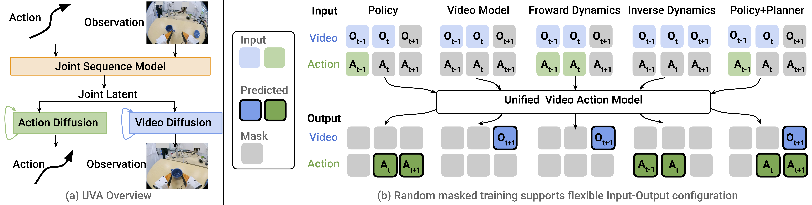

# Unified Video Action Model

[[Project page]](https://unified-video-action-model.github.io/)
[[Paper]](https://arxiv.org/abs/2503.00200)
[[Colab (PushT)]](https://colab.research.google.com/drive/1WQfiGat3pTr5DZqWa760zI3JrdH_M86O?usp=sharing)


[Shuang Li](https://shuangli59.github.io/),
[Yihuai Gao](https://yihuai-gao.github.io/),
[Dorsa Sadigh](https://dorsa.fyi/),
[Shuran Song](https://shurans.github.io/)

Stanford University



## 🛝 Try UVA on Colab
We provide a colab notebook for UVA on [PushT](https://colab.research.google.com/drive/1WQfiGat3pTr5DZqWa760zI3JrdH_M86O?usp=sharing) using the pretrained checkpoint.


## 🛠️ Installation
Install the conda environment:
```console
$ mamba env create -f conda_environment.yaml
```

## Simulation Experiments
### Testing
Download the pretrained checkpoints from the following links and put them in the `checkpoints/` folder.

* Checkpoint trained on [PushT](https://drive.google.com/file/d/1OduHcxfc2hqUYSccMQNf9g-vAt-q2UhF/view?usp=sharing) 
* Checkpoint trained on [PushT-M](https://drive.google.com/file/d/1ZppZJyQdEdjhu8TIt4ddyaWy_mSdjoAZ/view?usp=sharing)
* Checkpoint trained on [Libero10](https://drive.google.com/file/d/11c2VrmaRp48yw__5A5xpcu8EPzkexHSi/view?usp=sharing)

```
CUDA_VISIBLE_DEVICES=0 python eval_sim.py --checkpoint checkpoints/pusht.ckpt --output_dir checkpoints/pusht
```

```
CUDA_VISIBLE_DEVICES=0 python eval_sim.py --checkpoint checkpoints/pusht_multitask.ckpt --output_dir checkpoints/pusht_multitask
```

```
CUDA_VISIBLE_DEVICES=0 python eval_sim.py --checkpoint checkpoints/libero10.ckpt --output_dir checkpoints/libero10
```


### Training

#### Download Pretrained Models
We start from a pretrained VAE model and a pretrained image generation model [MAR](https://github.com/LTH14/mar). Run the following command to download the pretrained models.
```
python unified_video_action/utils/download.py
```


#### Train Video Generation Model
We find that first train the model on `video generation` task and then train the model on the `joint video and action` tasks performs better than directly training the model on the joint video and action tasks.
We found that two-stage training works better than training on both video and action tasks directly. In the first stage, the model is trained on `video generation` task, and in the second stage, it is fine-tuned on both video and action tasks.

To train the UVA model for the video generation task, we set `predict_action=False` and `selected_training_mode=video_model`. We did not incorporate additional video data during training. We believe that pretraining the model on large-scale web video datasets could substantially improve its generalization capabilities, and we plan to explore this approach in future work.

Training video and action model takes longer time than training policy model only. We recommend using at least 4 GPUs for training.
To train the UVA model on the PushT dataset, run the following command:

```
accelerate launch --num_processes=8 train.py \
    --config-dir=. \
    --config-name=uva_pusht.yaml \
    model.policy.action_model_params.predict_action=False \
    model.policy.selected_training_mode=video_model \
    model.policy.optimizer.learning_rate=1e-4 \
    logging.project=uva \
    hydra.run.dir="checkpoints/uva_pusht_video_model"
```

#### Train Joint Video and Action Model
To train the UVA model on the joint video and action tasks, we set `predict_action=True` and remove `selected_training_mode=video_model`.

To train the UVA model on the UMI multi-task dataset, run the following command:
```
accelerate launch --num_processes=8 train.py \
    --config-dir=. \
    --config-name=uva_pusht.yaml \
    model.policy.autoregressive_model_params.pretrained_model_path=checkpoints/uva_pusht_video_model/checkpoints/latest.ckpt \
    model.policy.action_model_params.predict_action=True
    model.policy.optimizer.learning_rate=1e-4 \
    logging.project=uva \
    hydra.run.dir="uva_pusht_video_act_model"
```


## Real Robot Experiments

**Be careful when conducting real robot experiments. The robot moves quickly and can be dangerous.**

### Testing

Download the pretrained checkpoints from the following links and put them in the `checkpoints/` folder. 
This checkpoint is trained on **500** samples from each of the three datasets: Cup, Towel, and Mouse.

* Checkpoint trained on [UMI Multitask](https://drive.google.com/file/d/1rUWtpXReULf8h42P80Go7GeTiZs3irFS/view?usp=sharing) 

#### ARX X5 Robot Setup

Please follow the instructions in [arx5-sdk](https://github.com/real-stanford/arx5-sdk) to setup the ARX X5 robot controller. Other models of robot arms could be used by modifying the arguments when running the controller. 

To setup the UMI-related hardware (Camera, Gripper, etc.), please refer to the codebase of [UMI-on-Legs](https://github.com/real-stanford/umi-on-legs) and check out the [3d printing](https://github.com/real-stanford/umi-on-legs/blob/main/real-wbc/docs/3d_printing.md) and [assembly](https://github.com/real-stanford/umi-on-legs/blob/main/real-wbc/docs/assembly.md) instructions. 

#### UVA Deployment

We recommend first deploying the [umi-arx](https://github.com/real-stanford/umi-arx) codebase to test the hardware setup. For UVA deployment, please checkout the `uva` branch for some updates with more safety checks. 

Instead of running the `detached_policy_inference.py` in the `UMI` codebase, please run `sh scripts/eval/eval_real.sh` to serve the UVA model. You can modify the parameters in the `eval_real.sh` for different checkpoints and tcp ports. The rest of the deployment process is the same as the original `UMI` codebase. 

### Training

#### Train Video Generation Model
To train the video generation model on the UMI multi-task dataset, run the following command:

```
accelerate launch --num_processes=8 train.py \
    --config-dir=. \
    --config-name=uva_umi_multi.yaml \
    model.policy.action_model_params.predict_action=False \
    model.policy.selected_training_mode=video_model \
    model.policy.different_history_freq=True \
    model.policy.optimizer.learning_rate=1e-4 \
    task.dataset.dataset_root_dir=${dataset_path} \
    logging.project=uva \
    hydra.run.dir="checkpoints/uva_umi_multitask_video"
```

For all real-world experiments, we set `different_history_freq=True` to use distinct history frequencies during training. Since the control frequency on real robot may differ from the data frequency in the collected dataset, using different history frequencies helps the model perform better during testing.


#### Train Joint Video and Action Model

To train the UVA model on the UMI multi-task dataset, run the following command:
```
accelerate launch --num_processes=8 train.py \
    --config-dir=. \
    --config-name=uva_umi_multi.yaml \
    model.policy.autoregressive_model_params.pretrained_model_path=checkpoints/uva_umi_multitask_video/checkpoints/latest.ckpt \
    model.policy.action_model_params.predict_action=True \
    model.policy.use_proprioception=True \
    model.policy.predict_proprioception=True \
    model.policy.shift_action=False \
    model.policy.different_history_freq=True \
    model.policy.optimizer.learning_rate=1e-4 \
    task.dataset.dataset_root_dir=${dataset_path} \
    task.dataset.used_episode_indices_file=${indices_file} \
    logging.project=uva \
    hydra.run.dir="uva_umi_multitask_video_action"
```


## Dataset
All datasets are publicly available except for `PushT-M`. We extend the `PushT` task by incorporating various target “T” positions and have collected a new dataset containing 247 demonstrations. Download the datasets and put them in the `data` folder.

### Simulation Datasets
* [PushT](https://diffusion-policy.cs.columbia.edu/data/training/pusht.zip) from [Diffusion Policy](https://github.com/real-stanford/diffusion_policy).
* [PushT-M](https://drive.google.com/file/d/14VqUC_LL411o9F_qdjVZlgiRBjZknw01/view?usp=sharing) from us. Download the file, extract its contents, and place them in the `data` folder.
* [Libero10](https://utexas.box.com/shared/static/cv73j8zschq8auh9npzt876fdc1akvmk.zip) from [LIBERO](https://libero-project.github.io/main.html). We replayed the data to extract the absolute actions and appended language tokens from [CLIP](https://openai.com/index/clip/) using `AutoTokenizer.from_pretrained("openai/clip-vit-base-patch32")`. Download both the original [hdf5 file](https://drive.google.com/file/d/1_6Kc7e-s30MblbX8YjpxSofe9ZRPk3xv/view?usp=sharing) and the converted [dataset](https://drive.google.com/file/d/1cPU2RVAvtukyapcWly8zP1y-dlOEF2ko/view?usp=sharing). Then, extract their contents and place them in the `data` folder.
* [Toolhang](https://diffusion-policy.cs.columbia.edu/data/training/robomimic_image.zip) from [Diffusion Policy](https://github.com/real-stanford/diffusion_policy). We use the file `ph/image_abs.hdf5`. Place it in the `data/tool_hang/ph/image_abs.hdf5` folder.

### Real-World Datasets
* [UMI CUP Arrangement](https://real.stanford.edu/umi/data/cup_in_the_wild/cup_in_the_wild.zarr.zip) from [UMI](https://github.com/real-stanford/universal_manipulation_interface).
* [UMI Towel Folding](https://huggingface.co/datasets/Fanqi-Lin/Processed-Task-Dataset/resolve/main/fold_towel/dataset.zarr.zip?download=true) from [Data Scaling Laws in Imitation Learning for Robotic Manipulation](https://github.com/Fanqi-Lin/Data-Scaling-Laws).
* [UMI Mouse Arrangement](https://huggingface.co/datasets/Fanqi-Lin/Processed-Task-Dataset/resolve/main/arrange_mouse/dataset.zarr.zip?download=true) from [Data Scaling Laws in Imitation Learning for Robotic Manipulation](https://github.com/Fanqi-Lin/Data-Scaling-Laws).
* [More UMI Datasets](https://umi-data.github.io/) for large-scale training. Please run `process_dataset/download_dataset.py` to download and process the datasets.


#### UMI Multi-Task Dataset Processing

We modified the `UMI` dataloader to support multiple UMI datasets. We also optimized the memory usage and data loading speed especially when running on a SLURM system for large scale training. 

The pipeline of processing the dataset is as follows, see `process_dataset/download_dataset.py` for more details:

1. Download the dataset (`.zarr.zip` format) from the corresponding urls. You can comment out the lines you don't need.
2. Copy the dataset into shared memory (`/dev/shm`) and decompress it to a `.zarr` folder. The script is processing all the selected datasets in parallel, thus please make sure the server has enough available memory (at least 500GB). If not, you can run the `process_dataset` function (in `download_dataset.py`) inside a `for` loop.
3. Compress the dataset using `lz4` for faster compression and decompression speed. Then copy the `.zarr.tar.lz4` files back to your `data_dir`.

During training, you can run `process_dataset/extract_umi_data.py` to extract multiple datasets into your shared memory `/dev/shm` or a local disk in a SLURM system. When loading data batches, the dataloader `unified_video_action/dataset/umi_multi_dataset.py` will randomly choose a UMI dataset and fetch the data from the shared memory in a "lazy" manner, i.e. only copy the data into program memory when needed and release it afterwards. Therefore during training, there will not be duplicated data in memory even if you are training on multiple GPUs. 

Note that we do not use mirrors in the deployment setup. Therefore, we mask out all the mirror regions in the dataset whose gripper has mirror. You can modify the `mask_mirror` option in `umi_multi.yaml` to specify individually for each dataset.

For multi-node training, please refer to `scripts/training/train_uva_umi_multi_node.sh` if you are using SLURM.


## 🩹 Add Your Own Task
To add your own task, you need to implement a dataset, an environment runner, and a task configuration file. For guidance, please refer to the following examples from existing tasks:
* `unified_video_action/config/task/umi_multi.yaml`
* `unified_video_action/dataset/umi_multi_dataset.py`


Make sure that `shape_meta` correspond to input and output shapes for your task. Make sure `env_runner._target_` and `dataset._target_` point to the new classes you have added. When training, add `task=<your_task_name>` to `train.py`'s arguments.

## 🩹 Add Your Own Model
To add your own model, you need to implement a configuration file, a workspace, and a policy file. For guidance, please refer to the following examples from existing models:
* `unified_video_action/config/model/uva.yaml`
* `unified_video_action/workspace/train_unified_video_action_workspace.py`
* `unified_video_action/policy/unified_video_action_policy.py`


## 🙋 Questions & Answers
**Are there any tips for training UVA?**

We found that two-stage training works better than training on both video and action tasks simultaneously. In the first stage, the model is trained on video generation, and in the second stage, it is fine-tuned on both video and action tasks.

**How long does it take to train UVA?**

Training time depends on both the size of the dataset and the complexity of the task. For the UMI task, we sampled 500 trajectories from each of the three datasets and trained the model using 8 H100 GPUs. The video generation task was trained for 2 days, while the joint video and action generation requires an additional 2 days.

**What's the next step for UVA?**

We believe there is still significant potential in UVA that remains unexplored, and we leave this for future work.

Additional video data: UVA can leverage large amounts of actionless video data, which could provide valuable additional supervision. We plan to pretrain UVA on additional video data in the future.

Multi-modality: UVA can be naturally extended to predict modalities beyond video and action, such as sound and force, by incorporating additional diffusion heads, offering a more comprehensive and versatile framework.

Better architecture: The model architecture can be futuer improved by replacing the diffusion heads with flow matching.

Larger model size: UVA's performance may currently be limited by the model size. We plan to explore larger models in the future.


## 🏷️ License
This repository is provided under the MIT license. For more details, please refer to [LICENSE](LICENSE).


## 🙏 Acknowledgement
* Lots of code are inherited from [Diffusion Policy](https://github.com/real-stanford/diffusion_policy) and [MAR](https://github.com/LTH14/mar).
* For real-world UMI experiments, we use the public datasets collected by [UMI](https://github.com/real-stanford/universal_manipulation_interface) and [Data Scaling Laws in Imitation Learning for Robotic Manipulation](https://github.com/Fanqi-Lin/Data-Scaling-Laws).